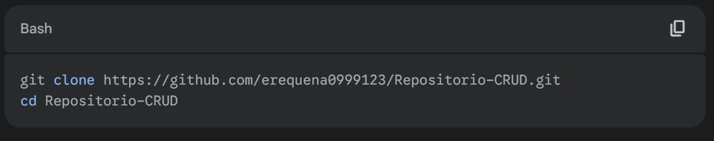
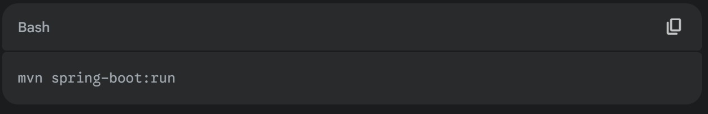
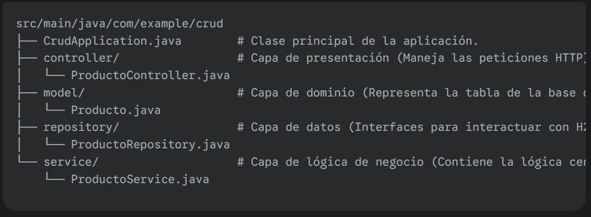
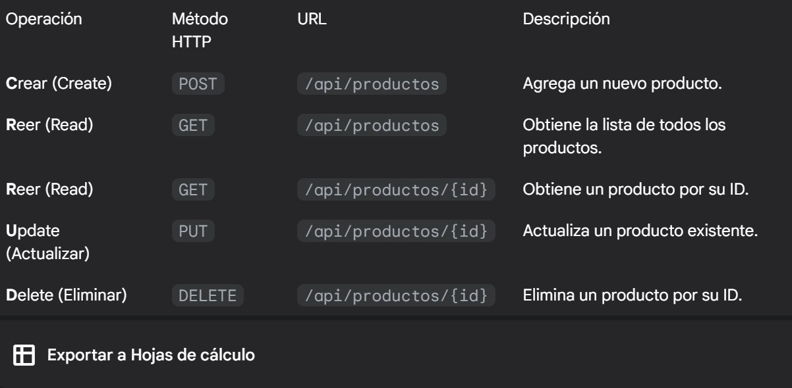
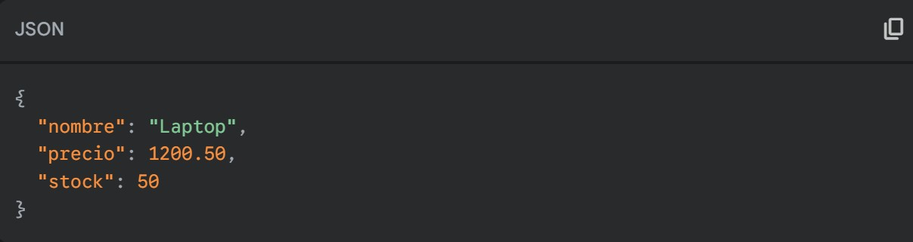

# Repositorio-CRUD

📚 Repositorio CRUD (Spring Boot + H2)
¡Bienvenido! Este es un proyecto de ejemplo que demuestra la implementación de operaciones CRUD básicas (Crear, Leer, Actualizar y Eliminar) utilizando Spring Boot, Spring Data JPA y la base de datos en memoria H2.

Este repositorio es ideal para aprender la estructura de un microservicio REST en Java y cómo interactuar con una base de datos de manera sencilla usando el patrón Repository.

🌟 Características Principales
Tecnología Backend: Java ☕ y Spring Boot.

Persistencia: Spring Data JPA (simplifica el acceso a datos).

Base de Datos: H2 Database (base de datos en memoria, perfecta para desarrollo y pruebas).

Operaciones: Implementación completa de la API REST para la entidad Producto con métodos CRUD.

🚀 Empezando
# 1. Requisitos
Asegúrate de tener instalado:

Java Development Kit (JDK) 17 o superior.

Maven (para la gestión del proyecto).

Un IDE como IntelliJ IDEA o Eclipse Spring Tools Suite (STS).

# 2. Clonar el Repositorio
Abre tu terminal y ejecuta:

# 3. Ejecutar la Aplicación
Puedes ejecutar la aplicación directamente desde tu IDE o usando Maven en la terminal:

 
La aplicación se iniciará por defecto en el puerto 8080.

# 🛠️ Estructura del Proyecto
El proyecto sigue la arquitectura de capas recomendada por Spring Boot para separar las responsabilidades:

 

# 💻 Endpoints de la API (CRUD)
La aplicación expone los siguientes endpoints REST para gestionar la entidad Producto (con ID Long):

 

Ejemplo de Objeto Producto
El cuerpo de las peticiones POST y PUT debe ser un JSON similar a este (el id se genera automáticamente):

 

# 🔎 Acceso a la Consola H2
Dado que usamos H2 en modo en memoria, puedes acceder a la consola web para ver los datos directamente.

Pasos:
Asegúrate de que la aplicación esté corriendo (mvn spring-boot:run).

Abre tu navegador y navega a la URL:
👉 http://localhost:8080/h2-console

Utiliza las siguientes credenciales (configuradas en src/main/resources/application.properties):

JDBC URL: jdbc:h2:mem:testdb

User Name: sa

Password: (dejar vacío)

Haz clic en Connect para acceder a la base de datos y ver la tabla PRODUCTO.

# 💡 Contribuciones
Si deseas mejorar este proyecto o reportar un error, siéntete libre de:

Hacer un Fork del repositorio.

Crear una nueva rama (git checkout -b feature/nueva-funcionalidad).

Realizar tus cambios (git commit -am 'feat: Agregada nueva funcionalidad').

Subir tus cambios a tu fork (git push origin feature/nueva-funcionalidad).

Abrir un Pull Request.

¡Gracias!

